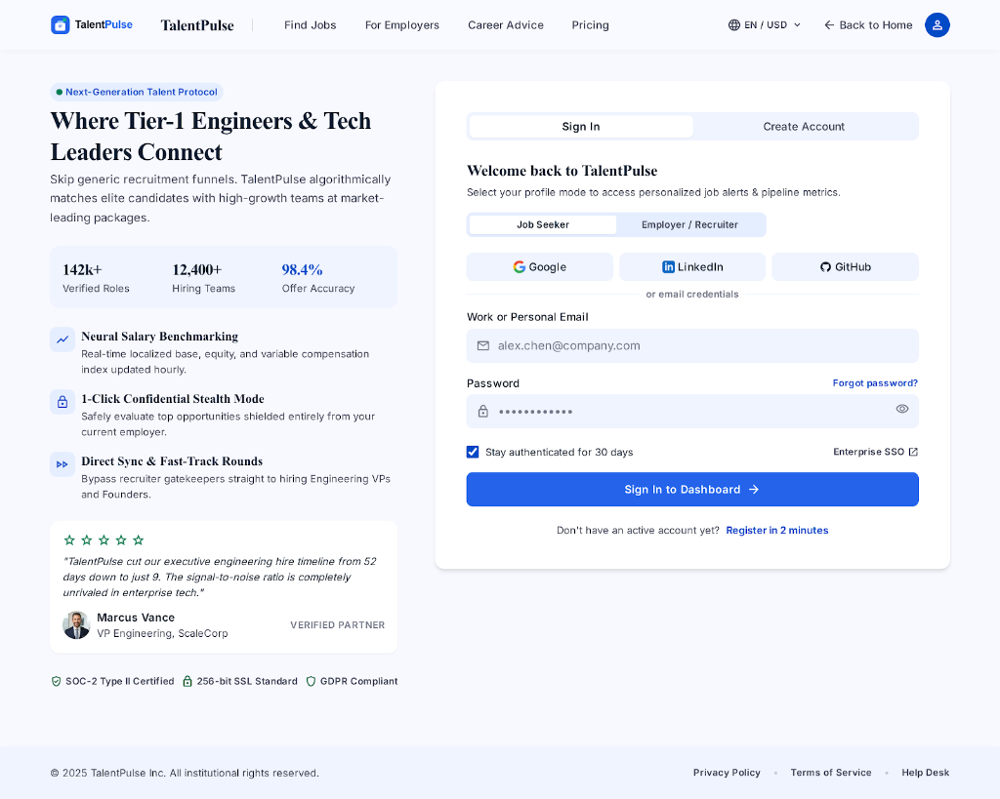
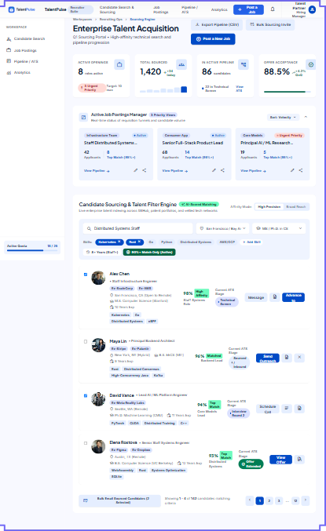
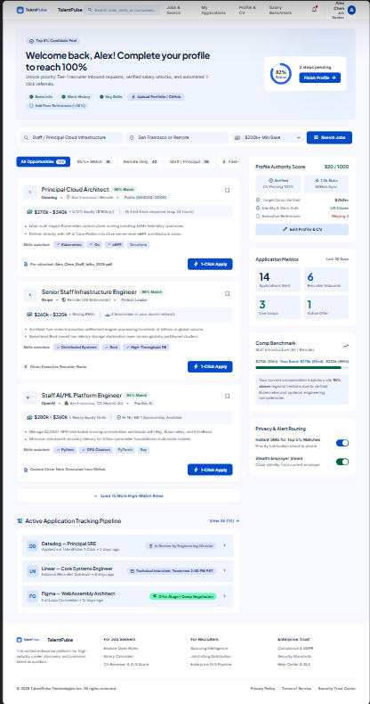
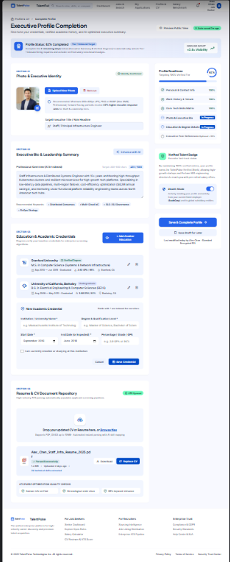
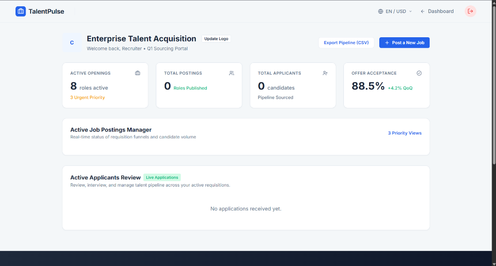
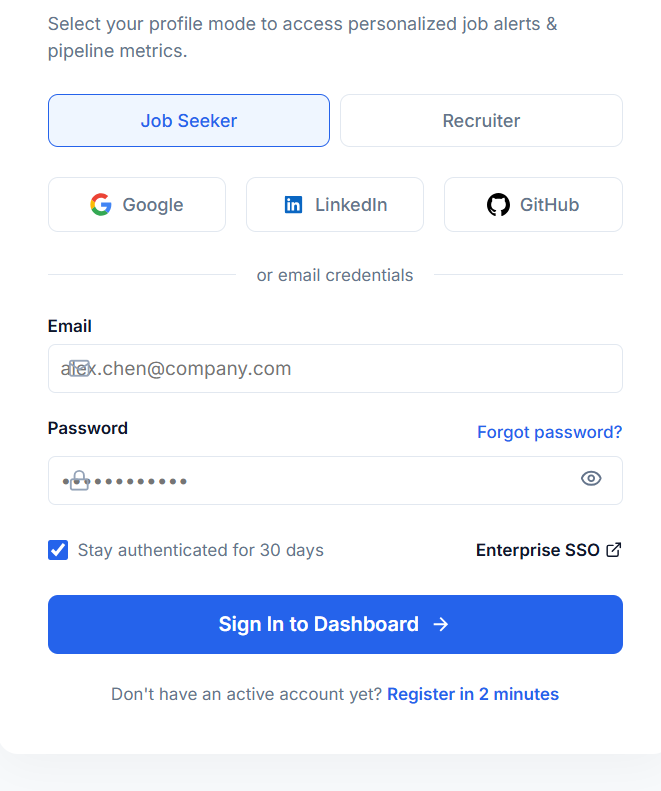
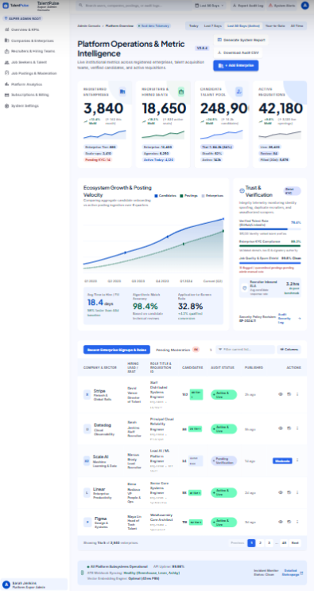
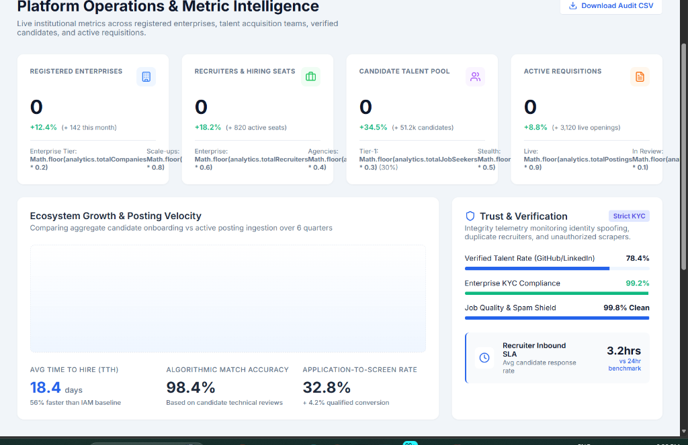
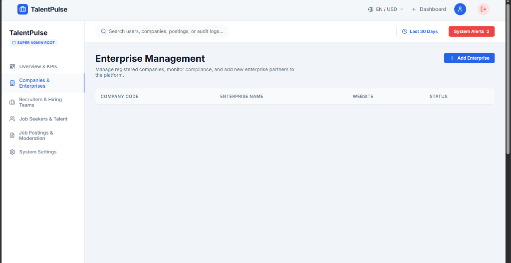

# Enterprise Job Portal 🚀

A modern, full-stack enterprise job portal designed for scalability and user experience. 

## 🌟 Key Features

- **Multi-Role Authentication System**: Separate dashboards and access controls for Administrators, Recruiters, and Job Seekers.
- **Enterprise Management (Admin)**: Create, monitor, and manage companies, track total recruiter seats, verify talent pools, and moderate job postings via a highly dynamic dashboard.
- **Recruiter Portal**: Post requisitions to the market, manage applicants, change application statuses, and track inbound SLAs.
- **Candidate Hub**: Job seekers can easily browse active postings, apply with 1-click workflows, and track their application statuses.
- **Robust Schema**: Advanced `@ManyToOne` / `@OneToMany` database relationships ensuring every posting is tied to both the enterprise (Company) and the author (Recruiter).

---

## 📸 Feature Snapshots

*(Below are the UI snapshots demonstrating the portal's features)*

### 1. Dashboard Overview & KPIs

Provides a high-level view of the entire platform's health including System Uptime, Job Quality, and Recruiter SLAs.

### 2. Company & Enterprise Management

A unified view showing live enterprises and the active amount of recruiter seats tied to them.

### 3. Recruiter Pool Tracking

Lists all verified recruiters across all enterprises, showing the total volume of postings they've explicitly uploaded.

### 4. Talent Pool & Job Seekers

Tracks all registered candidates and monitors how many applications they've initiated.

### 5. Live Market Requisitions

A live feed of all active job postings, their associated salaries, and how many candidates have applied.

### 6. Job Posting Workflows

Detailed view into the posting UI workflows.

### 7. Interactive Application Tracking

Status trackers and actionable recruiter tools to push candidates through the hiring pipeline.

### 8. Authentication & Onboarding

Secure and modern login/signup screens properly mapped to the correct user roles.

### 9. Dynamic System Tools

Dynamic modals and smooth user interfaces for frictionless hiring and applying.

---

## 🛠️ Technology Stack
- **Frontend**: React (Vite), CSS3 (Modern Glassmorphism & Animations)
- **Backend**: Spring Boot (Java), Spring Security, Hibernate ORM
- **Database**: MySQL (Advanced relational mapping and constraints)
- **Deployment**: `.env` decoupled architecture ensuring smooth CI/CD transitions between `localhost` and production builds.

## 🚀 How to Run Locally

### Frontend
1. Navigate to the `frontend/` directory.
2. Ensure you have a `.env` file with `VITE_API_URL=http://localhost:8080`.
3. Run `npm install` followed by `npm run dev`.

### Backend
1. Ensure MySQL is running on port 3306.
2. The `DB_URL` falls back to `jdbc:mysql://localhost:3306/job_portal` by default.
3. Run `.\mvnw.cmd spring-boot:run` to start the server.
